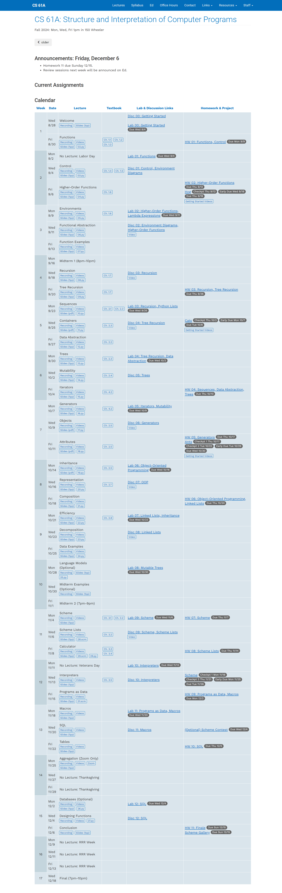

# CS61A

## Introduction
- This's my solution for **CS 61A (Fall 2024)**, which includes hws, labs, discussions and projects, limited to learning and legal communication. 
- Try to complete each discussion, lab, homework and project independently.

## Prerequisites
Basic Python programming language.

## Available Links
- [CS61A Homepage](https://cs61a.org/)
- [CS61A Textbook](http://www.composingprograms.com/)
- [CS61A Online Editor](https://code.cs61a.org/)

## Schedule for Fall 2024
I consider that learners can refer to the teaching schedule of Fall 2024 to arrange the learning sequence as follows:

## Contact:
- E-mail: Agvensome@outlook.com